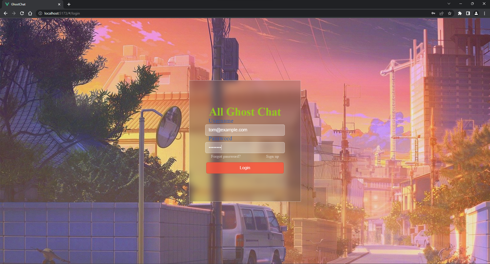
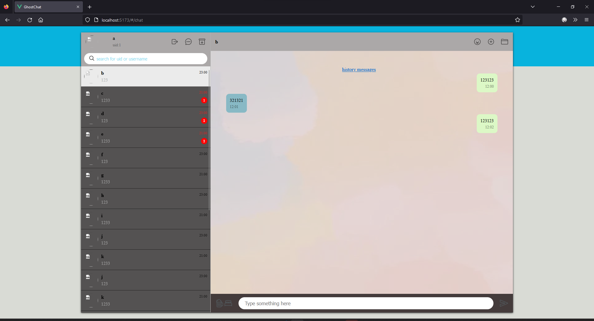
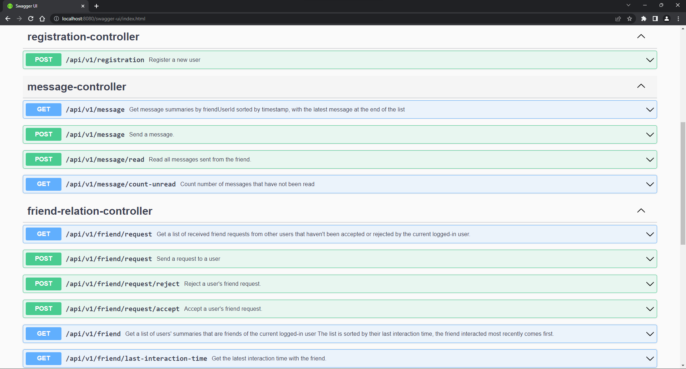
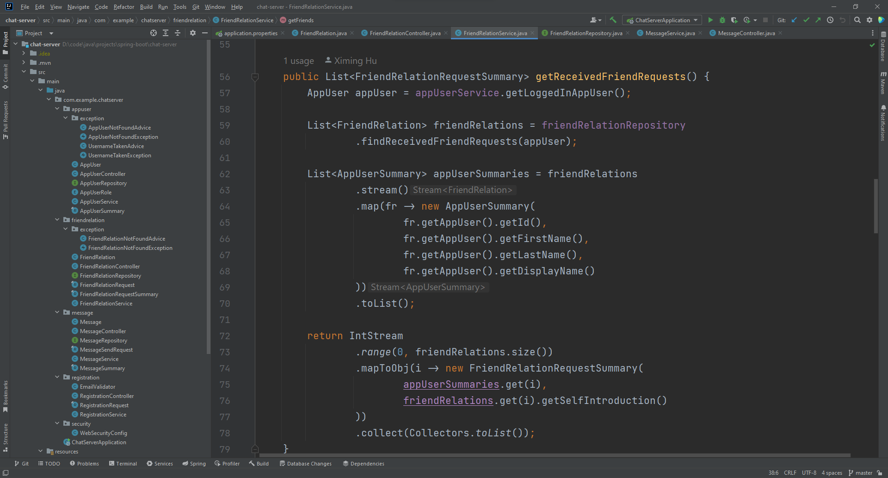

# Ghost Chat

## Components

| Component            | Developer    | Technologies                       | License | Link                                       |
| -------------------- | ------------ | ---------------------------------- | ------- | ------------------------------------------ |
| Backend server       | Ximing Hu    | Java, Spring Boot, Spring Security | AGPL    | <https://github.com/hu-ximing/chat-server> |
| Frontend interaction | Jiacheng Li  | Vue, TypeScript, JavaScript, html  |         | <https://github.com/LJC0414/GhostChat>     |
| Frontend design      | August Zheng | html, css                          |         | <https://github.com/Zheng-August/html>     |

## Installation

Ghost Chat installation script can be found [here](https://github.com/hu-ximing/ghost-chat-installation-script).

## Inspiration

1. To make a free chat software that respects user's freedom to inspect and modify the source code.

2. To learn and apply programming knowledge.

3. To exercise our group members' teamwork, communication, and problem-solving skills.

## What it does

- Sign up
  
  New user can submit their username (unique email), password, first name, last name, and display name. A user account will be provided.

- Login
  
  User can submit username and password. The server authenticates against that user.

- Logout
  
  Clear authentication status and show the login page again.

- Main page
  
  The main page is shown after the user has logged in.
  
  - Friend list

    Display a list of friends. The list is displayed in order: the closer the interaction time is, the higher the friend will be displayed in the list. When clicking an entry, initiate a dialog with that friend.
  
  - Dialog box

    Used to display the message history. Messages are listed as message boxes comprised of their content and timestamp. User can enter text in the input field at the bottom. Click the send button to send message.

- Messaging
  
  Users can send text to their friends in the dialog box. Messaging history will be saved on the application server.
  
  If A send a message to B while B is not in the dialog with A, the message is considered unread. In B's friend list, the entry of friend A displays a badge, representing the number of unread messages;
  
- Friend requests
  
  Users can send friend requests to other users. A friend request includes the friend user id and sender's self introduction.
  
  Users can view received friend requests from other users and optionally accept or reject friend requests.

## How we built it

### Building web page

[Learn more](https://github.com/LJC0414/GhostChat)

```shell
git clone https://github.com/LJC0414/GhostChat.git
cd GhostChat/
# resolve dependencies
npm install
# start the live server
npm run dev
# build static html and javascript in dist/
npm run build
```

### Building backend service

[Learn more](https://github.com/hu-ximing/chat-server)

Run the application

```shell
git clone https://github.com/hu-ximing/chat-server.git
cd chat-server/
./mvnw spring-boot:run
```

Package to jar file

```shell
./mvnw install
```

## Challenges we ran into

Spring Boot has a steep learning curve.

Vue has a steep learning curve.

Designing the look, interaction and logic of the website is challenging.

Configuring the server requires extensive knowledge.

## Accomplishments that we're proud of

It works.

## What we learned

Beside the technologies listed in the table above, we learned to use git to manage our projects and collaborate effectively.

## What's next for Ghost Chat

- Searching users
  
  Search for unknown users by id or username and list the search results.
  
  Click on the search result to show the summaries of that user.

  Click on "Add friend" to send that user a  friend request.

- Group chat
  
  Groups are displayed in the friends list in the same way as users, but the name shows the group name.

  The dialog section shows the message history of all group members.

  When the user clicks on the button to create a group, the group creation interface is displayed, which lists all the friends of the user and the corresponding checkbox. Checked checkbox indicates that the new group includes this user.

  Enter the new group name and click the Done button.

- Sending pictures and files

- End-to-end encryption using asymmetric key pairs

## Screenshots

Login page



Chat page



API documentation (OpenAPI generated)



IDE


